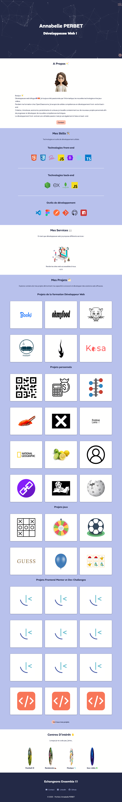

## PORTFOLIO

## 🚀 Le challenge

Ce projet est un portfolio web personnel et moderne, conçu pour présenter mes projets, mes compétences et mon parcours professionnel en tant que développeuse web. Il a été entièrement développé à la main (en HTML5, CSS3) pour garantir des performances optimales et un design sur mesure.

Ce projet comporte différentes fonctionnalitées :

- **Design Responsive :** Adapté à tous les écrans (ordinateurs, tablettes et mobiles) grâce aux media queries CSS.
- **Navigation Fluide :** Défilement fluide (_smooth scroll_) vers les différentes sections.
- **Effet d'apparittion au défilement de la page**: via JavaScript.

## 📸 Démonstration

Lien vers le projet : https://aperbet56.github.io/portfolio/

## 🛠️ Projet développé avec

- Utilisation des balises sémantique HTML5
- CSS3
- Flexbox
- Animations CSS (transition, @keyframes)
- Desktop first
- Page web responsive
- Font-awesome CDN
- Utilisation d'un normaliseur : le fichier normalize.css
- Importation des polices "Alan Sans" et "DM Sans"
- Variables CSS
- Commentaires HTML
- Commentaires CSS
- Page validé par le validateur HTML du W3C
- Page validé par le validateur CSS du W3C
- JavaScript
- Code JavaScript commenté
- API intersection observer
- Minification des fichiers CSS et JavaScript

## ✉️ Contact

- **Nom :** Annabelle PERBET
- **LinkedIn :** [https://www.linkedin.com/in/annabelle-perbet-862784256/]
- **Portfolio en ligne :** [https://aperbet56.github.io/portfolio/]

## 📝 Licence

Ce projet est sous licence MIT.
